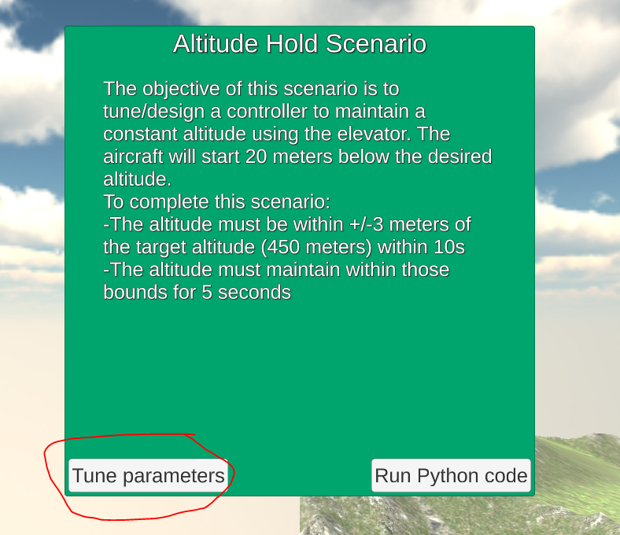
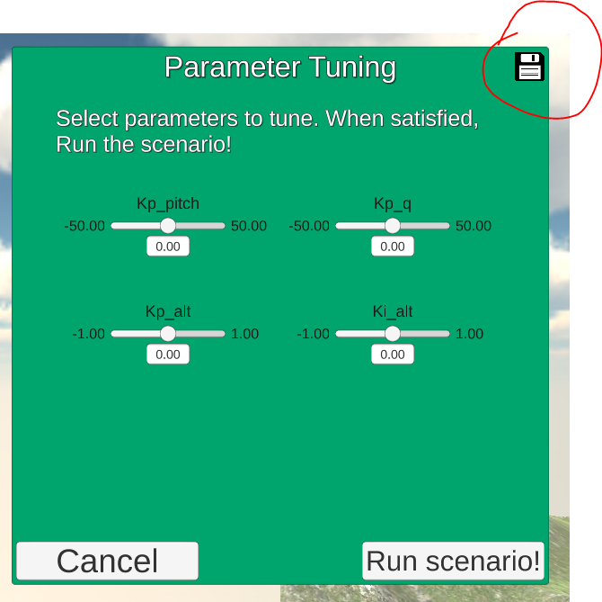

# FCND - Fixed Wing Project #

This is the readme for the Udacity Flying Car Nanodegree Fixed Wing Project

For easy navigation throughout this document, here is an outline:

 - [Development environment setup](#development-environment-setup)
 - [Simulator walkthrough](#simulator-walkthrough)
 - [Control the Simulator with Python](#pyton-control)
 - [The Scenarios](#the-scenarios)
 - [Evaluation](#evaluation)

## Development Environment Setup ##

Regardless of your development platform, the first step is to download or clone this repository.

### Udacidrone ###

Next you'll need to get the latest version of [Udacidrone](https://udacity.github.io/udacidrone/docs/getting-started.html).
If you've previously installed Udacidrone, ensure that you are working with version 0.3.2 or later.

### Unity Simulation ###

Finally, download the version of the simulator that's appropriate for your operating system [from this repository](https://github.com/udacity/FCND-FixedWing/releases). (v0.1.2 or higher for longitudinal scenarios)

## Simulator Walkthrough ##

Now that you have all the code on your computer and the simulator running, let's walk through some of the elements of the code and the simulator itself.

### Fixed Wing UI ###

The simulator interface should look fairly familiar to the Unity quadcopter simulation with a few additions:

- Airspeed is displayed along with the GPS information
- Scenario menu (explained more below), the simulation will start in the Sandbox mode
- Throttle setting (displays the throttle setting between 0 (no throttle) and 1 (full throttle)

### Sandbox Mode ###

Try flying around in sandbox mode. There are several different flight modes available, you'll start in manual.

#### Manual Mode ####

You have direct control over the throttle, ailerons, elevators, and rudder. Use the following keyboard commands to control the aircraft:

- C/Space: throttle control (incremental)
- Up/Down Arrow: elevator control
- Left/Right Arrow: aileron control
- Q/E: rudder control
- W/S: elevator trim (incremental)

#### Other Flight Modes ####

TBD

### Scenario Selection ###

Click the scenario selection menu to see a drop-down list of possible scenarios. When you select a scenario, the aircraft will be reset to a specified starting location and you will be shown a start-up screen. The start-up screen will describe the scenario task and the evaluation criteria. In the start-up screen, you'll have two options to choose from:

- Tune parameters: select control parameters for the Unity simulation will be displayed for tuning prior to starting the scenario. The scenario will be run with the unity simulation
- Run Python code: a screen will appear waiting for Python controller to connect/arm. The screen will disappear and the scenario will start once the vehicle is armed from Python

Most of the scenarios have a time limit associated with them. Upon completion (pass or fail) there will be a window showing your result. From there, you can select another scenario or continue retry the current scenario.

### Tuning Unity Parameters

The gains of the control system used internally on the Unity simulation can be tuned. The longitudinal and lateral control gains are tuned independently but the control gains within each type build upon each other (i.e. you cannot tune the other loop without first tuning the inner loop gains). To tune the gains:

1. Default gains are loaded from the text file, gains.txt. The file will be located in the same folder as the simulation executable. Set the values prior to running th program.
2. Choose the appropriate scenario from the scenario selection menu
3. Click the "Tune Parameter" button

4. A list of parameters will appear. Adjust the sliders or the set the fields to the values you'd like for the parameters.

5. Run the scenario!
6. If you want to save the parameters to a text file, click the save button on the top right corner. The parameters are saved to a file named gains_new.txt. To use these default values next time the simulation is executed, rename the file to gains.txt

## Python Control ##

The simulation can also be controlled using a Python script and the Udacidrone API. There are three relevant python files found in the FixedWing project repository:

- plane_control.py: this is where you will fill in the control code
- plane_drone.py: contains PlaneDrone, a sub-class of the Udacidrone drone class with additional commands specific to the fixed wing project
- fixed_wing_project.py: contains a subclass of PlaneDrone specifically set-up to run the scenarios

### Running a scenario ###
To run a scenario from Python:
1. Select the scenario within the Unity simulation
2. Select the "Run From Python" button, you should see a "Waiting for Python" message
3. Change fixed_wing_project.py to execute the same scenario (see below)
3. Execute fixed_wing_project.py and the scenario should start autonomatically:

~~~
python fixed_wing_project.py
~~~

If fixed_wing_project.py is run before being prompted onscreen in the Unity simulation, the python code will be unable to connect.

TODO: This needs to be easier to execute for the students possible with a command line argument
To select a different scenario, you need to change the last line of fixed_wing_project.py prior to executing it. For example the following will run the Trim scenario

~~~
drone.run_scenario(Scenario.TRIM)
~~~

The following are valid scenario names:
* Scenario.SANDBOX
* Scenario.TRIM
* Scenario.AIRSPEED
* Scenario.ALTITUDE
* Scenario.CLIMB
* Scenario.LONGITUDINAL
* Scenario.ROLL
* Scenario.TURN
* Scenario.YAW
* Scenario.LINE
* Scenario.ORBIT
* Scenario.LATERAL 

## The Scenarios ##

You'll be implementing several Python controllers in the plane_control.py in order to complete all the scenarios. The scenarios are divided into 2 categories:

- Longitudinal Scenarios
- Lateral/Directional Scenarios

The scenarios within a category will build on one another, so you will need to implement and tune them in order. Each category will end in a challenge which will use the control loops you set up in the preceding scenarios.

Prior to completing a scenario, it's suggested that you first use the Unity based controller to tune the gains. If implemented correctly on Python, the Unity controller gains should get close to meeting the objectives of the scenario, although minor tuning may be required.

### Longitudinal Scenarios ###

The longitudinal scenarios are designed to incrementally implement control loops to command the aircrafts airspeed, pitch, and altitude using the elevator and the throttle. When running these scenarios from Python, a Unity based lateral controller will maintain a near-zero bank and sideslip.

#### Scenario #1: Trim (Unity Only) ####

The objective of this scenario is to find a fixed throttle trim for level flight with no elevator input.

To achieve success in this scenario two objectives must be met for at least 5 seconds:

- The vertical speed must be less than 0.5 m/s
- The airspeed rate must be less than 0.1 m^2/s

This scenario will run indefinitely.

Completing this scenario will help find a route estimate for your feed-forward throttle setting.

Tips:

- Try small increments in your throttle
- If both the airspeed AND altitude are increasing, the throttle is probably too high.
- If both the airspeed AND altitude are decreasing, the throttle is probably too low.
- If the airspeed and altitude are opposite from one another, you'll have to wait for the the phugoid mode to damp out.
- The phugoid oscillations can be very lightly damped, the damping can be assisted by using the elevator controls.

#### Scenario #2: Altitude Hold ####

The objective of this scenario is to tune/implement a controller to maintain a constant altitude using the elevator. The throttle will be set to a fixed value. The altitude hold should be implemented using successive loop closure as shown above. The inner loop will be a PD controller on the aircraft pitch. The outer loop will be a PI controller on the aircraft altitude. Ensure to implement anti-windup for the integrator.

To complete this scenario:

- The altitude must be within +/-3 meters of the target altitude (450 meters) within 10s
- The altitude must maintain within those bounds for 5 seconds

This controller should be implemented in plane_control.py, by filling in the following functions:
~~~py

"""Used to calculate the elevator command required to acheive the target
    pitch

	Args:
		pitch: in radians
		pitch_rate: in radians/sec
		pitch_cmd: in radians

	Returns:
		elevator_cmd: in percentage elevator [-1,1]
"""
def pitch_loop(self, pitch, pitch_rate, pitch_cmd):
	elevator_cmd = 0.0
	# STUDENT CODE HERE
	return elevator_cmd

"""Used to calculate the pitch command required to maintain the commanded
    altitude
    
    Args:
    altitude: in meters (positive up)
    altitude_cmd: in meters (positive up)
    dt: timestep in seconds

	Returns:
		pitch_cmd: in radians
"""
def altitude_loop(self, altitude, altitude_cmd, dt):
	pitch_cmd = 0.0
	# STUDENT CODE HERE
	return pitch_cmd
~~~

Tips:

- Implement and tune the inner most loop first and work outward.
- Increase the proportional pitch gain until the aircraft is nearly unstable OR set a maximum pitch angle and set the gain to be full elevator at the maximum pitch angle
- Increase the derivative pitch gain to achieve a nice dynamic response (fast but not too many oscillations)
- Next, increase the proportional altitude gain until your achieve a nice step response
- Finally, increase the integral altitude gain to meet the scenario objective threshold.
 

#### Scenario #3: Airspeed Hold ####

The objective of this scenario is to tune/implement a controller to maintain a constant airspeed. The altitude will be maintained using the altitude controller from the previous scenario. The controller should be implemented as a PI controller using the throttle setting. Ensure to implement anti-windup for the integrator.

To complete this scenario:

- The airspeed must be within +/- 0.5 meters/sec of the target airspeed (41 meters/sec) within 10s
- The airspeed must maintain the airspeed within those bounds for 5 seconds

This controller should be implemented in plane_control.py, by filling in the following function:
~~~py

"""Used to calculate the throttle command required command the target 
    airspeed

	Args:
		airspeed: in meters/sec
		airspeed_cmd: in meters/sec
        dt: timestep in seconds

	Returns:
		throttle_command: in percent throttle [0,1]
"""
def airspeed_loop(self, airspeed, airspeed_cmd, dt):
	throttle_cmd = 0.0
	# STUDENT CODE HERE
	return throttle_cmd  
~~~

Tips:

- First, set your throttle feed-forward value determined from the trim analysis
- Next, increase the proportional gain until you get an acceptable step response (fast but not too many oscillations)
- Increase the integral gain to increase the rate at which the steady state error is removed
- If you notice a large contribution from the integral portion of your controller at steady state, adjust your feed-forward throttle setting accordingly. This should allow you to decrease the value of you integral gain (and provide a better dynamic response).

#### Scenario #4: Steady Climb ####

The objective of this scenario is to tune/design a controller to maintain a constant airspeed using the elevator with full throttle and a PI controller as shown above. This will put the aircraft in a steady climb. In the previous scenario, the pitch angle was used to control altitude. In this scenario, the pitch angle will be used to control the airspeed. Ensure to implement anti-windup for the integrator.

To complete this scenario:

- The airspeed must be within +/-1 meters/sec of the target airspeed (41 meters/sec) within 10s
- The airspeed must maintain within those bounds for 5 seconds

This controller should be implemented in plane_control.py, by filling in the following functions:
~~~py

"""Used to calculate the pitch command required to maintain the commanded
    airspeed

	Args:
		airspeed: in meters/sec
		airspeed_cmd: in meters/sec
        dt: timestep in seconds

	Returns:
		pitch_cmd: in radians
"""

def airspeed_pitch_loop(self, airspeed, airspeed_cmd, dt):
	pitch_cmd = 0.0
	# STUDENT CODE HERE
	return pitch_cmd
~~~

Tips:

- Use the same inner loop pitch controller from the previous scenario. If you change the inner loop gains, return to the previous scenario to ensure they meet the altitude hold objectives.
- If you saturated the commanded pitch inside the inner loop, you may have to increase the limits. A steady climb at full throttle will need to command higher pitch angles than a constant altitude controller.
- Start with increasing the proportional airspeed gain to achieve a nice dynamic response (fast but not too many oscillations)
- Finally, increase the integral airspeed gain to meet the scenario objective threshold.

### Scenario #5: Longitudinal Challenge ###

The objective of this challenge is to successfully fly through a series of virtual gates in the sky. 
To do this, tune/implement a longitudinal state machine: 
 
 - If the vehicle is within a specified threshold of the target altitude, use the maintain altitude controller.
 - If the vehicle is below or above the target altitude by the specified threshold, use the steady climb/descend controller with full or min throttle (respectively)

To complete the challenge, your altitude must be within +/-3 meters when arriving at the gate.
The gate locations (x = horizontal distance from the start location):

 - Gate #1: x = 200m, altitude=200m
 - Gate #2: x = 1100m, altitude = 300m
 - Gate #3: x = 1400m, altitude = 280m
 - Gate #4: x = 2200m, altitude = 200m

This controller should be implemented in plane_control.py, by filling in the following functions:

~~~py

"""Used to calculate the pitch command and throttle command based on the
    aicraft altitude error

	Args:
		airspeed: in meter/sec
		altitude: in meters (positive up)
		airspeed_cmd: in meters/sec
		altitude_cmd: in meters/sec (positive up)
        dt: timestep in seconds

	Returns:
		pitch_cmd: in radians
		throttle_cmd: in in percent throttle [0,1]
"""
def longitudinal_loop(self, airspeed, altitude, airspeed_cmd, altitude_cmd, dt):
	pitch_cmd = 0.0
	throttle_cmd = 0.0
	# STUDENT CODE HERE
	return[pitch_cmd, throttle_cmd]
~~~

Tips:

- The only parameter to tune in the challenge should be the threshold at which to switch between the different modes of control. The altitude hold scenario starts the aircraft 20m below the target altitude, which would be a good starting point for this threshold.
- Well tuned parameters from the Longitudinal scenarios will help make this challenge less challenging. If you change your control gains for this challenge, return to the scenarios to ensure the new gains meet the objectives of all previous scenarios.

### Lateral/Directional Scenarios ###

The lateral/directional scenarios are designed to incrementally implement control loops to command the aircrafts airspeed, pitch, and altitude using the elevator and the throttle. When running these scenarios from Python, a Unity based longitudinal controller will maintain altitude and airspeed.

#### Scenario #6: Stabilized Roll Angle ####

The objective of this scenario is to tune/design a controller to maintain a constant roll angle using PD control as shown above. The aircraft will start at 45 degree roll angle and the controller should return the aircraft to wings level (0 degree roll). In this scenario roll angle and roll rate will be used to calculate a desired aileron command.

To complete this scenario:

- The roll angle must be within +/- 5 degrees within 5s
- The roll angle must maintain within those bounds for 5 seconds

This controller should be implemented in plane_control.py, by filling in the following functions:
~~~py

"""Used to calculate the commanded aileron based on the roll error
    
    Args:
	    phi_cmd: commanded roll in radians
    	phi: roll angle in radians
    	roll_rate: in radians/sec
    	T_s: timestep in sec

	Returns:
		aileron: in percent full aileron [-1,1]
"""
def roll_attitude_hold_loop(self,
							phi_cmd,  # commanded roll
							phi,    # actual roll 
							roll_rate, 
							T_s = 0.0):
	aileron = 0
	# STUDENT CODE HERE
	return aileron
~~~

Tips:

- Increase the proportional until you start seeing small oscillations near wings level. Add a derivative term to smooth the dynamic response
- Due to the high drag of the wings, the derivative term may not be necessary to complete the objectives. The derivative term is required for a complete solution
- The aircraft should be near symmetric, but if you are seeing a small steady state error near wings level, increase your proportional gain to decrease this error. Do not add an integral term!

#### Scenario #7: Coordinated Turn ####

The objective of this scenario is to tune/design a controller to regulate the sideslip of the aircraft during a banked turn using PI control as shown above. The aircraft will be commanded to a 45 degree bank angle, which will cause the aircraft to sideslip. The coordinated turn assumptions used in the course hold assume that the turn is coordinated and the sideslip is near zero. The sideslip (approximated from the aircraft velocity and heading) will be used to calculate the rudder command. Ensure to implement anti-windup for the integrator.

To complete this scenario:

- The sideslip must be within +/- 0.5 degrees within 25s
- The airspeed must maintain the airspeed within those bounds for 5 seconds
- The integrator uses a discrete integration technique. The timestep used in the Unity simulation is smaller than the python timestep, therefore you may experience integration issues when moving to the Python simulation. You may need to lower your dependence on the integral term when executing python control (smaller gain) or try a higher order integration method (trapezoidal instead of Euler).

This controller should be implemented in plane_control.py, by filling in the following functions:

~~~py

"""Used to calculate the commanded rudder based on the sideslip

    Args:
        beta: sideslip angle in radians
        T_s: timestep in sec
        
    Returns:
        rudder: in percent full rudder [-1,1]
"""
def sideslip_hold_loop(self,
                       beta, # sideslip angle 
                       T_s):
    rudder = 0
    # STUDENT CODE HERE
    return rudder
~~~

Tips:

- Increase the proportional gain to meet the objectives. Increase the integral gain to remove any remaining steady state error.
- You may not be able to drive the steady state error complete to zero, but the smaller it is, the easier the following scenarios will be.

#### Scenario #8: Constant Course/Yaw Hold ####

The objective of this scenario is to tune/design a controller to maintain a constant course/yaw angle using PI control as shown above. The target yaw is zero degrees; the aircraft will start with a 45 degree yaw. The current vehicle heading will be used to calculate a roll command. Ensure to implement anti-windup for the integrator. The commanded roll rate should be saturated between at a 60 degrees maximum. The feed-forward roll should be included in this solution. The feed-forward for this scenario but his term is used in the orbit scenario.

To complete this scenario:

- The yaw must be within +/- 5 degrees of the target course (0 degrees) within 10s
- The airspeed must maintain the airspeed within those bounds for 5 seconds

This controller should be implemented in plane_control.py, by filling in the following functions:

~~~py

"""Used to calculate the commanded roll angle from the course/yaw angle
    Args:
        yaw_cmd: commanded yaw in radians
        yaw: roll angle in radians
        roll_rate: in radians/sec
        T_s: timestep in sec
        roll_ff: feed-forward roll command (for orbit scenario)
        
    Returns:
        roll_cmd: commanded roll in radians
"""
def yaw_hold_loop(self,
                     yaw_cmd,  # desired heading
                     yaw,     # actual heading 
                     T_s,
                     roll_ff=0):
    roll_cmd = 0
    # STUDENT CODE HERE
    return roll_cmd

~~~

Tips:

- Ensure the course error is appropriately between -PI and PI (i.e. a heading of 350 degrees should have 10 degrees of error, not -350!) 
- Increase the proportional gain to have the dynamic response desired (speedy with little/no overshoot). Add a small integral gain to remove any steady state error.
- Since there are no disturbances, an integral gain should not be required to complete this scenario but should be included in the final solution. The integral gain will also help complete the following scenarios.
- The integrator uses a discrete integration technique. The timestep used in the Unity simulation is smaller than the python timestep, therefore you may experience integration issues when moving to the Python simulation. You may need to lower your dependence on the integral term when executing python control (smaller gain) or try a higher order integration method (trapezoidal instead of Euler).

#### Scenario #9: Straight Line Following ####

The objective of this scenario is to tune/design a controller to track the aircraft to the desired line. The line will be defined as an origin point and course. You'll first calculate the crosstrack error from the line and use that to generate a commanded heading (based on an arctan based trajectory towards the line). The infite course approach angle used in the simulation is perpendicular to the line (PI/2), but feel free to play around with different values in your python implementation. The aircraft will start 20 meters to offset from the line.

To complete this scenario:

- The crosstrack error from the line must be within +/- 3 meters within 25s
- The crosstrack error must maintain within those bounds for 5s

This controller should be implemented in plane_control.py, by filling in the following functions:

~~~py

"""Used to calculate the desired course angle based on cross-track error
    from a desired line

    Args:
        line_origin: point on the desired line in meters [N, E, D]
        line_course: heading of the line in radians
        local_position: vehicle position in meters [N, E, D]
        
    Returns:
        course_cmd: course/yaw cmd for the vehicle in radians
"""
def straight_line_guidance(self, line_origin, line_course, 
                           local_position):
    course_cmd = 0
    # STUDENT CODE HERE
    return course_cmd

~~~

Tips:

- Make sure to include the course of the line in your final course command. You will still be able to complete this scenario while forgetting it because the course command is 0 degrees, but it will hurt you in future scenarios.
- When using the Unity simulation, a blue arrow is provided on the compass heading showing your desired heading angle. If that heading moves faster than the aircraft can change its heading, your line following gain may be too high. If aircraft heading oscillates around that value, you may need to return to the previous scenario and adjust your proportional yaw gain. If the aircraft heading lags behind the blue arrow, you may need to adjust your integral yaw gain in the previous scenario.
- 
#### Scenario #10: Orbit Following ####
The objective of this scenario is to tune/design a controller to track the vehicle to a circular orbit. This controller requires two parts. The first generates a course command based on the current radius from the orbit origin and the aircraft heading. The second part calculates the feed-forward roll required for desired turning radius of the orbit (assuming a coordinate turn). Although this scenario is a clockwise orbit, the controller should be able to handle counter clockwise turns also. The aircraft will start with zero roll angle on the orbit. 

To complete this scenario:

- The radius from the orbit center (North = 0 meters, East = 500 meters) must be within +/- 5 meters of the target radius (500 meters) within 15s
- The radius from the orbit center must maintain within those bounds for 5 seconds

This controller should be implemented in plane_control.py, by filling in the following functions:

~~~py

"""Used to calculate the desired course angle based on radius error from
    a specified orbit center
    
    Args:
        orbit_center: in meters [N, E, D]
        orbit_radius: desired radius in meters
        local_position: vehicle position in meters [N, E, D]
        yaw: vehicle heading in radians
        clockwise: specifies whether to fly clockwise (increasing yaw)
        
    Returns:
        course_cmd: course/yaw cmd for the vehicle in radians
"""
def orbit_guidance(self, orbit_center, orbit_radius, local_position, yaw,
                   clockwise = True):
    course_cmd = 0
    # STUDENT CODE HERE
    return course_cmd
    
"""Used to calculate the feedforward roll angle for a constant radius
    coordinated turn

    Args:
        speed: the aircraft speed during the turn in meters/sec
        radius: turning radius in meters
        cw: true=clockwise turn, false = counter-clockwise turn
        
    Returns:
        roll_ff: feed-forward roll in radians
"""
def coordinated_turn_ff(self, speed, radius, cw):
    roll_ff = 0
    # STUDENT CODE HERE
    return roll_ff
    
~~~

Tips:

- Increase the gain to ensure the course command guides the vehicle back to the orbit within the threshold
- You will not be able to complete this scenario without including the feed-foward term in your course controller
- When using the Unity simulation, a blue arrow is provided on the compass heading showing your desired heading angle. If that heading moves faster than the aircraft can change its heading, your line following gain may be too high. If aircraft heading oscillates around that value, you may need to return to the previous scenario and adjust your proportional yaw gain. If the aircraft heading lags behind the blue arrow, you may need to adjust your integral yaw gain in the previous scenario.

### Scenario #11: Lateral/Directional Challenge ###

The objective of this challenge is to successfully fly through a series of virtual gates in the sky. All the positions given in this scenario are relative to the vehicle start location.
To do this, tune/implement a lateral state machine using the vehicle position and heading to generate a course command and feed-forward roll. Your state machine should include function calls to the straight_line_guidance, orbit_guidance, and coordinated_turn_ff functions:

  The first leg (before Gate #1) should implement a line following controller between North =  0 meters, East = 20 meters and Gate #1.
  The second leg (between Gate#1 and Gate #2) should implement an orbit following controller around the orbit center North = 500 meters, East = -380 meters (radius = 400 meters)
  The third leg (between Gate #2 and Gate #3) should implement an orbit following controller around the orbit center North = 600 meters, East = -380 (radius = 300 meters)
  The final leg (between Gate #3 and Gate #4) should implement a line following controller between the two gates.
  
To complete the challenge, you must be within +/-5 meter lateral distance when arriving at the gate.

The gate locations:

- Gate #1: North = 500m, East = 20m
- Gate #2: North = 900m, East = -380m
- Gate #3: North = 600m, East = -680m
- Gate #4: North = 100m, East = -680m

This controller should be implemented in plane_control.py, by filling in the following functions:

~~~py

"""Used to calculate the desired course angle and feed-forward roll
    depending on which phase of lateral flight (orbit or line following) the 
    aicraft is in

    Args:
        local_position: vehicle position in meters [N, E, D]
        yaw: vehicle heading in radians
        airspeed_cmd: in meters/sec
        
    Returns:
        roll_ff: feed-forward roll in radians
        yaw_cmd: commanded yaw/course in radians
"""
def path_manager(self, local_position, yaw, airspeed_cmd):
    
    roll_ff = 0
    yaw_cmd = 0
    # STUDENT CODE HERE
    
    return(roll_ff,yaw_cmd)

~~~

Tips:

- If you see a slow response when going from line following to orbit follow (or vice versa), reset your integrators to 0 when transitioning to a new phase of flight.
- If you having trouble with the last straight line leg, did you include the course command in your line following controller?
- If you having trouble with the orbit segments, did you implement the changes necessary to do a counter clockwise orbit?
- There are not any gains to tune for this scenario, so if the vehicle seems to be in the correct phase of flight, but you are still not hitting the gates, go back to previous scenarios to exceed the scenario requirements, not just meet minimum requirements.

### Scenario #12: Full 3D Challenge ###

TBD

## Evaluation ##

The longitudinal, lateral/directional, and full 3D challenges will be evaluated for successful completion of the objectives. Success implementation includes the control loops as described in the scenarios plus gains tuned to complete the three challenges.

### Inconsistent Results ###

The scenarios/challenges are evaluated within Unity using the true aircraft position. Due to asynchronous communication between the Python controller and Unity, successive runs of the same scenario with the same controller may yield different results depending on the speed of your machine and/or other processes running on it.

If this is the case here are some tips to help get a consistent result:

- Don't stress! Implementing controllers for aircraft in the real world yield different results every time they are tested! If you can get a successful result more than 50% of the time, save the log file from one of the successful runs. Most likely the implementation will be a success when evaluated because it will be run on sufficiently fast machines.
- Tune the gains to not only meet the objectives of the scenarios but also exceed them.
- Try being less aggressive on your inner loops (smaller gains)
- Use the simple graphics setting available in the simulation.